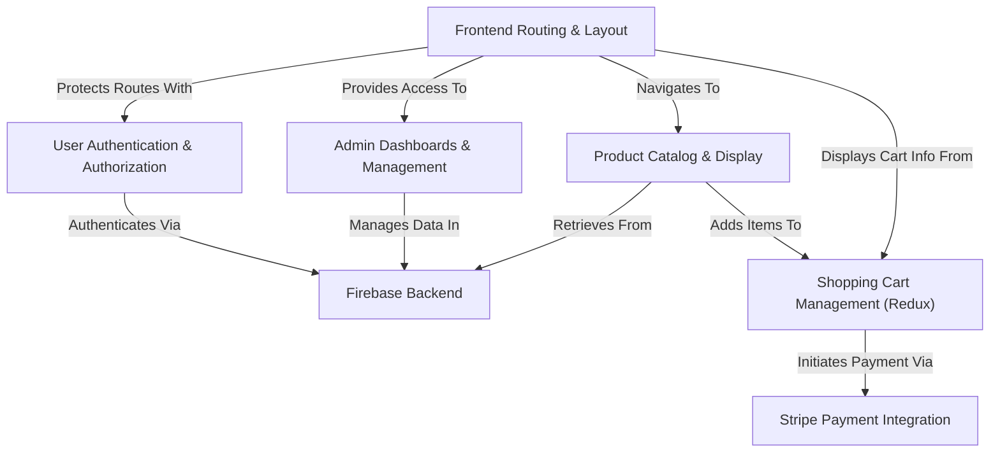

# 🎨 JMC Store — Minimalist Art Gallery Ecommerce Platform

A simple online art gallery & ecommerce platform built for gallery owners, artists, collectors, and investors. With minimal user-friendly browsing, role-based dashboards, Firebase Firestore, Stripe checkout, and Google authentication.
This was a project for a small Art Gallery in New York.

NOTE: This project was from 2022 and is no longer maintained (several security issues exist)

---

## Technologies Used

---

# Tutorial: JMC-Store

JMC-Store is an *online art gallery* where users can **browse and purchase unique paintings**. It allows talented *New York artists* to showcase their work, while administrators can **efficiently manage** the art catalog, user accounts, and artist profiles through a dedicated dashboard. All application data, including user profiles and product details, is securely stored and managed using **Firebase**, and all purchases are processed through **Stripe** for secure financial transactions.

## Visual Overview

## Chapters

1. [Frontend Routing & Layout
](chapters/01_frontend_routing___layout_.md)
2. [Product Catalog & Display
](chapters/02_product_catalog___display_.md)
3. [Shopping Cart Management (Redux)
](chapters/03_shopping_cart_management__redux__.md)
4. [Stripe Payment Integration
](chapters/04_stripe_payment_integration_.md)
5. [Firebase Backend
](chapters/05_firebase_backend_.md)
6. [User Authentication & Authorization
](chapters/06_user_authentication___authorization_.md)
7. [Admin Dashboards & Management
](chapters/07_admin_dashboards___management_.md)

---

## Contributing

Feel free to make it your own!
To contribute:

1. Fork the repo  
2. Create your feature branch (`git checkout -b feature/YourFeature`)  
3. Commit your changes (`git commit -m 'Add YourFeature'`)  
4. Push to the branch (`git push origin feature/YourFeature`)  
5. Open a Pull Request 

---

## Contact

For questions or feedback:

- Email: [mileshwebdev@gmail.com](mailto:mileshwebdev@gmail.com)  
- GitHub: [@mhwebdevelopment](https://github.com/mhwebdevelopment)
- Website(s)[mhwebdevelopment.com](https://www.mhwebdevelopment.com)

---

## License

Licensed under the [MIT License](LICENSE).

---

Generated by [AI Codebase Knowledge Builder](https://github.com/The-Pocket/Tutorial-Codebase-Knowledge).
