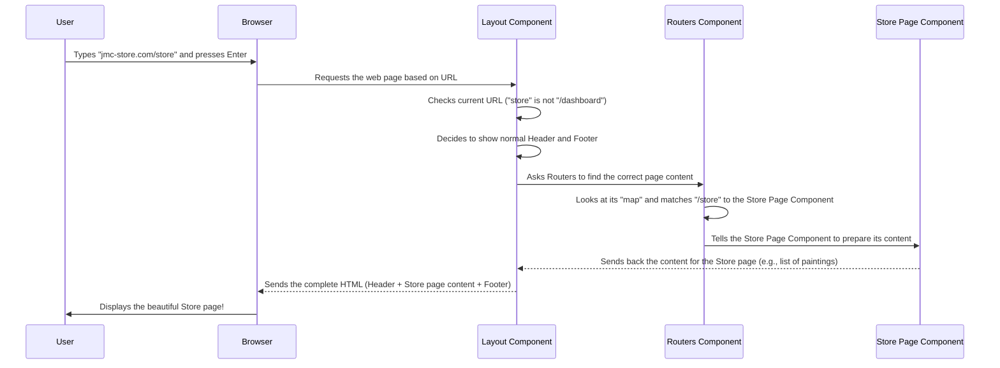

# Chapter 1: Frontend Routing & Layout

Welcome to the exciting world of building the JMC-Store website! In this first chapter, we're going to explore two fundamental ideas that help us build any website: "Frontend Routing" and "Layout." Don't worry if these sound complicated – we'll break them down step-by-step.

### What are Routing and Layout?

Imagine our JMC-Store website as a beautiful art gallery.

*   **Layout** is like the main structure of the building itself – the consistent roof, floor, and outer walls that are always there no matter which room you are in. On a website, this means things like the main navigation bar (Header) at the top, and the copyright information (Footer) at the bottom. These parts usually stay the same across many pages, providing a consistent look and feel. Sometimes, the layout might change a little, like when you go into a "staff-only" area (our Admin Dashboard), which has its own special navigation.

*   **Routing** is like the pathways or signs inside the gallery that tell you how to get from the entrance to the "Impressionist Paintings" room, or to the "Sculpture" room, and back. On a website, routing decides "what page to show" when you type a specific address (called a URL) into your browser, or when you click a link. For example, if you type `www.jmc-store.com/store`, routing makes sure you see the main "Store" page. If you type `www.jmc-store.com/cart`, it shows you your shopping cart.

### Why Do We Need Them?

Without routing and layout, our website would be a single, giant, confusing page! It would be hard to find anything, and every piece of information would be jumbled together.

**The main problem they solve:** How do we make an online store with many different pages (like Home, Store, Cart, About Us, Login, and even a special Admin Dashboard) feel organized, easy to navigate, and consistent?

Let's take a common example: You want to browse the art collection. You'd expect to click a "Store" link and see a list of paintings. Then, you might click "Cart" to see items you want to buy. You also expect the website's logo and navigation to always be at the top, and contact info at the bottom. Routing and Layout work together to make this smooth experience possible.

### How JMC-Store Uses Routing and Layout

Our JMC-Store project uses a popular library called **React Router DOM** to handle routing. Think of it as the GPS for our website.

#### 1. Defining Pathways with `Routers.js`

In our project, the `src/routers/Routers.js` file is like the central map that tells our website which "page" to display for each "address" (URL).

Here's a simplified look at how it works:

```javascript
// File: jmc-ecom/src/routers/Routers.js
import { Routes, Route, Navigate } from 'react-router-dom';
import Home from '../pages/Home'; // This is our Home page component
import Store from '../pages/Store'; // This is our Store page component
import Cart from '../pages/Cart';   // This is our Cart page component

const Routers = () => {
  return (
    <Routes>
      {/* When someone goes to "/" (the very first page), redirect them to "/home" */}
      <Route path="/" element={<Navigate to="home" />} />
      {/* If the address is "/home", show the Home page */}
      <Route path="home" element={<Home />} />
      {/* If the address is "/store", show the Store page */}
      <Route path="store" element={<Store />} />
      {/* If the address is "/cart", show the Cart page */}
      <Route path="cart" element={<Cart />} />
      {/* ... many more routes for different pages ... */}
    </Routes>
  );
};
export default Routers;
```

**Explanation:**
*   `Routes` is like the big container for all our pathways.
*   `Route` is a single pathway.
*   `path` tells React Router which URL segment to look for (e.g., `home`, `store`, `cart`).
*   `element` tells React Router which "page component" (like `Home`, `Store`, `Cart`) to show when that `path` is matched.
*   The `<Navigate to="home" />` is a special instruction that says: if someone just types our website's main address (`/`), automatically take them to the `home` page.

So, if you type `jmc-store.com/store` in your browser, the `Routers` component sees `store`, and then displays the `Store` page for you!

#### 2. Creating the Consistent Structure with `Layout.jsx`

The `src/components/Layout.jsx` file is where we define the overall building structure (our layout). It acts as a wrapper around all the different pages defined in `Routers.js`. This is where we ensure the Header and Footer are always visible, and handle special cases like the Admin Dashboard.

```javascript
// File: jmc-ecom/src/components/Layout.jsx
import React from 'react';
import Header from './Header'; // Our consistent top section
import Footer from './Footer'; // Our consistent bottom section
import Routers from '../routers/Routers'; // Where all our pages are defined
import AdminNav from '../admin/AdminNav'; // Special navigation for admin section
import { useLocation } from 'react-router-dom'; // Helps us know the current page address

const Layout = () => {
  const location = useLocation(); // Get the current website address (URL)
  // Check if the current address starts with "/dashboard" (our admin area)
  const isAdminPath = location.pathname.startsWith('/dashboard');

  return (
    <> {/* This is just a way to group elements without adding extra HTML */}
      {/* If it's an admin path, show Header AND AdminNav. Otherwise, just Header. */}
      {isAdminPath ? (
        <>
          <Header />
          <AdminNav />
        </>
      ) : (
        <Header />
      )}

      {/* This is where the specific page content (Home, Store, Cart, etc.) will appear */}
      <Routers />

      {/* The Footer always appears at the bottom */}
      <Footer />
    </>
  );
};
export default Layout;
```

**Explanation:**
*   `Layout` brings together the `Header`, `Footer`, and `Routers` components.
*   `useLocation()` is a special tool from React Router that lets us know the current web address. This is super useful for making decisions!
*   We check if the current address `startsWith('/dashboard')`. This is how we know if the user is in the special "admin" part of the website.
*   If it's an admin path, we include the `AdminNav` component (which is like a special navigation menu just for admins) along with the regular `Header`. Otherwise, we just show the `Header`.
*   Crucially, `Routers />` is placed *between* the Header/AdminNav and the Footer. This means whatever page `Routers` decides to show (like the "Store" page or "Cart" page) will appear right in the middle, surrounded by our consistent header and footer.

#### 3. Navigation Links in Header and Footer

To actually move between pages, we use `Link` or `NavLink` components provided by React Router. These are like clickable signs in our gallery.

Here's a tiny part of the `Header.jsx` file that shows how navigation links are created:

```javascript
// File: jmc-ecom/src/components/Header.jsx
import React from 'react';
import { NavLink } from 'react-router-dom'; // The special link component

const nav__links = [
  { path: 'home', display: 'Home' },
  { path: 'store', display: 'Store' },
  { path: 'cart', display: 'Cart' },
];

const Header = () => {
  return (
    <header className="header">
      <div className="navigation">
        <ul className="menu">
          {nav__links.map((item, index) => (
            <li className="nav__item" key={index}>
              {/* When you click this, React Router takes you to the 'item.path' */}
              <NavLink to={item.path}>{item.display}</NavLink>
            </li>
          ))}
        </ul>
      </div>
      {/* ... other header content like logo, icons ... */}
    </header>
  );
};
export default Header;
```
**Explanation:**
*   Instead of standard HTML `<a href="...">` links, we use `NavLink`. `NavLink` is smart: it knows when its `path` matches the current URL, and it can add a special class (`nav__active` in this case) to make the link look different (e.g., highlighted) so you know which page you're currently on.

The `Footer.jsx` file also uses similar `Link` components to help users navigate to important pages:

```javascript
// File: jmc-ecom/src/components/Footer.jsx
import React from 'react';
import { Link } from 'react-router-dom'; // Another link component

const Footer = () => {
  return (
    <div className="footer">
      {/* ... some other footer content ... */}
      <div className="footer__quick-links">
        <h4>Links</h4>
        <ul> {/* Simplified for example */}
          <li><Link to="/store">Store</Link></li>
          <li><Link to="/cart">Cart</Link></li>
          <li><Link to="/login">Login/Signup</Link></li>
        </ul>
      </div>
      {/* ... more footer content ... */}
    </div>
  );
};
export default Footer;
```
**Explanation:**
*   `Link` is used when you just need to navigate to a new page without special styling for active links. It functions similarly to `NavLink` in terms of taking you to the new `to` address.

#### 4. Special Admin Navigation (`AdminNav.jsx`)

The `src/admin/AdminNav.jsx` component is another example of routing and layout working together. It's a special navigation menu that only appears when an administrator is logged in and viewing the dashboard section of the site.

```javascript
// File: jmc-ecom/src/admin/AdminNav.jsx
import React from 'react';
import { NavLink } from 'react-router-dom'; // For navigating within admin
const admin__nav = [
  { display: 'Dashboard', path: '/dashboard', },
  { display: 'All Paintings', path: '/dashboard/all-products', },
  { display: 'Users', path: '/dashboard/users', },
  // ... more admin links
];
const AdminNav = () => {
  return (
    <section className="admin__menu p-0">
      <div className="admin__navigation">
        <ul className="admin__menu-list">
          {admin__nav.map((item, index) => (
            <li className="admin__menu-item" key={index}>
              {/* NavLink highlights the active admin page */}
              <NavLink
                to={item.path}
                className={(navClass) =>
                  navClass.isActive ? 'admin__menu-active' : ''
                }
              >
                {item.display}
              </NavLink>
            </li>
          ))}
        </ul>
      </div>
    </section>
  );
};
export default AdminNav;
```
**Explanation:**
*   Similar to the main `Header`, `AdminNav` uses `NavLink` to create clickable links for different parts of the admin dashboard (e.g., Dashboard overview, All Paintings, Users).
*   Notice how all these paths start with `/dashboard` (like `/dashboard/all-products`, `/dashboard/users`). This is why our `Layout.jsx` checks `location.pathname.startsWith('/dashboard')` to decide when to show this specific navigation.

### How It All Works Together (Under the Hood)

Let's imagine you're a user and you want to go to the JMC-Store's main product page. Here's a simplified sequence of what happens:



In short:
1.  When you open the website, the `Layout` component is the first thing loaded.
2.  The `Layout` component immediately looks at the current web address.
3.  Based on the address, it decides whether to show the regular `Header` and `Footer`, or if it also needs to add the `AdminNav` (for dashboard pages).
4.  Then, the `Layout` component uses the `Routers` component to figure out which specific "page" (like `Home`, `Store`, or `Cart`) should be displayed in the main content area.
5.  Finally, the browser receives the full web page, which now includes the consistent header, the chosen page content, and the consistent footer.

### Conclusion

In this chapter, we learned that "Frontend Routing" is like creating a map for our website, letting users navigate between different pages using specific web addresses (URLs). "Layout" is like the architectural blueprint that ensures our website has a consistent look and feel (Header, Footer) across all pages, while also adapting for special sections like the Admin Dashboard. These two concepts are foundational for building any well-organized and user-friendly web application.

Now that we understand how users move around our JMC-Store and how the website maintains its consistent appearance, we're ready to dive into what actually populates those pages! In the next chapter, we'll explore how JMC-Store displays all its beautiful art.

[Next Chapter: Product Catalog & Display](02_product_catalog___display_.md)

---

<sub><sup>Generated by [AI Codebase Knowledge Builder](https://github.com/The-Pocket/Tutorial-Codebase-Knowledge).</sup></sub> <sub><sup>**References**: [[1]](https://github.com/mhwebdevelopment/JMC-Store/blob/5458d78fa64e6f4f059a9638e7380066efb83ac3/jmc-ecom/src/admin/AdminNav.jsx), [[2]](https://github.com/mhwebdevelopment/JMC-Store/blob/5458d78fa64e6f4f059a9638e7380066efb83ac3/jmc-ecom/src/components/Footer.jsx), [[3]](https://github.com/mhwebdevelopment/JMC-Store/blob/5458d78fa64e6f4f059a9638e7380066efb83ac3/jmc-ecom/src/components/Header.jsx), [[4]](https://github.com/mhwebdevelopment/JMC-Store/blob/5458d78fa64e6f4f059a9638e7380066efb83ac3/jmc-ecom/src/components/Layout.jsx), [[5]](https://github.com/mhwebdevelopment/JMC-Store/blob/5458d78fa64e6f4f059a9638e7380066efb83ac3/jmc-ecom/src/routers/Routers.js)</sup></sub>