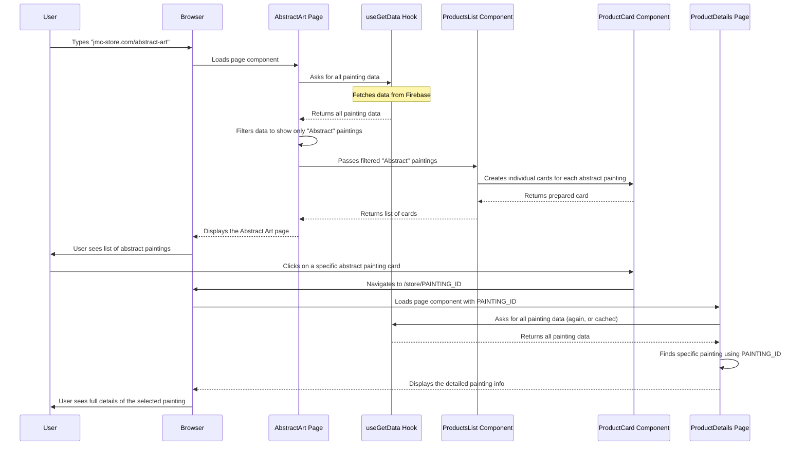

# Chapter 2: Product Catalog & Display

Welcome back to building the JMC-Store! In our [previous chapter on Frontend Routing & Layout](01_frontend_routing___layout_.md), we learned how to create the pathways for our website and ensure a consistent look (like the header and footer). Now that visitors can find their way around our beautiful art gallery, it's time to actually show them the art!

### What is Product Catalog & Display?

Imagine you walk into a physical art gallery. What do you see? You see paintings organized in different rooms or sections (like "Abstract" or "Contemporary" art). Each painting has a little plaque next to it telling you its name, the artist, and maybe a short description. If you really like a painting, you might want to learn even more details about it.

"Product Catalog & Display" in our JMC-Store is the digital version of this. It's how we:

1.  **Organize** our entire collection of paintings.
2.  **Showcase** them in a clear, browsable way (like a list or grid).
3.  **Present detailed information** for each specific artwork when a visitor wants a closer look.

**The main problem it solves:** How do we efficiently manage and beautifully present hundreds or thousands of paintings to our visitors, making it easy for them to find what they love?

Let's take a common example: A visitor comes to our JMC-Store website wanting to browse abstract art. They click on "Abstract Art" from the menu. Our system needs to:

*   Know which paintings are "Abstract."
*   Display them neatly in a list.
*   If the visitor clicks on one specific abstract painting, show all its details (large image, full description, artist info, price).

This chapter will guide you through how JMC-Store achieves this.

### Key Concepts for Displaying Art

To build our online art catalog, we rely on a few core ideas:

#### 1. Product Data: The Art Collection Itself

First, we need the actual information about each painting: its name, image, price, what category it belongs to (Abstract, Contemporary, etc.), and who the artist is. This data needs to be stored somewhere.

For JMC-Store, we use a special tool called `useGetData` (which connects to our future [Firebase Backend](05_firebase_backend_.md)) to fetch this information. For now, just think of `useGetData` as a magic helper that brings all the painting details from our digital "storage room" to our website.

#### 2. Product Card: A Peek at Each Painting

When you're browsing a gallery, you don't see every tiny detail of every painting at once. You see smaller previews. In JMC-Store, each painting preview is called a "Product Card." It shows just enough info to catch your eye: the painting's image, name, and price.

The `src/components/UI/ProductCard.jsx` file is responsible for creating these individual cards.

```javascript
// File: jmc-ecom/src/components/UI/ProductCard.jsx (Simplified)
import React from 'react';
import { Link } from 'react-router-dom'; // To make the card clickable
import { Col } from 'reactstrap'; // For layout (columns)

const ProductCard = ({ item }) => {
  return (
    <Col lg="3" md="4" className="mb-2"> {/* Takes up 3 or 4 columns on larger screens */}
      <div className="product__item">
        {/* When clicked, links to a detailed page for this painting */}
        <Link to={`/store/${item.id}`}>
          <div className="product__image">
             {/* The painting image */}
          </div>
          <div className="p-2 product__info">
            <h3 className="product__name">{item.productName}</h3> {/* Painting name */}
          </div>
        </Link>
        <span className="price">${item.price}</span> {/* Price */}
        {/* ... other parts like add to cart button ... */}
      </div>
    </Col>
  );
};
export default ProductCard;
```
**Explanation:**
*   The `ProductCard` component takes `item` (which is one painting's data) as a "prop" (short for property, like an input).
*   It uses `item.imgUrl`, `item.productName`, and `item.price` to show basic info.
*   Most importantly, it uses a [React Router DOM](01_frontend_routing___layout_.md) `Link` component. When you click anywhere on the card, it takes you to a special address `/store/` followed by the painting's unique `id`. This `id` is crucial for fetching the full details later!

#### 3. Product List: Displaying Many Paintings

We rarely show just one product card. Usually, we want to show a whole collection! This is where the "Product List" comes in. It's a component that takes a list of painting data and then, for each painting, tells a `ProductCard` to display it.

The `src/components/UI/ProductsList.jsx` file does exactly this.

```javascript
// File: jmc-ecom/src/components/UI/ProductsList.jsx
import React from 'react';
import ProductCard from './ProductCard'; // Our individual painting cards

const ProductsList = ({ data }) => {
  return (
    <> {/* This is just a container */}
      {/* For each 'item' (painting) in the 'data' list, create a ProductCard */}
      {data?.map((item, index) => (
        <ProductCard item={item} key={index} />
      ))}
    </>
  );
};
export default ProductsList;
```
**Explanation:**
*   `ProductsList` receives a `data` prop, which is an array (a list) of many painting objects.
*   It uses the `map()` function (a common JavaScript tool) to go through each painting in the `data` list.
*   For every `item` (one painting) in the list, it creates a `ProductCard` component and passes that `item` to it. This means if you have 10 paintings in your `data` list, `ProductsList` will create 10 `ProductCard`s, arranging them nicely on the page.

#### 4. Product Details Page: The Full Story

When a visitor wants to know everything about a specific painting, they click on its Product Card. This takes them to a dedicated page that shows all the information, like the large image, the artist's name, the full description, etc.

The `src/pages/ProductDetails.jsx` file handles this.

```javascript
// File: jmc-ecom/src/pages/ProductDetails.jsx (Simplified)
import React, { useEffect, useState } from 'react';
import { Container, Row, Col } from 'reactstrap';
import { useParams } from 'react-router-dom'; // To get the painting's ID
import useGetData from '../custom-hooks/useGetData'; // To fetch painting data

const ProductDetails = () => {
  const [product, setProduct] = useState({}); // To store the details of THIS painting
  const { id } = useParams(); // Gets the 'id' from the URL (e.g., "painting123" from /store/painting123)
  const { data: allProducts } = useGetData('products'); // Get ALL paintings

  useEffect(() => {
    // Find the specific painting that matches the 'id' from the URL
    const foundProduct = allProducts.find((item) => item.id === id);
    if (foundProduct) {
      setProduct(foundProduct); // Store the found painting's details
    }
  }, [id, allProducts]); // Re-run this when ID or ALL products change

  const { imgUrl, productName, artist, price, description } = product; // Get details from the found product

  return (
    <section>
      <Container>
        <Row>
          <Col lg="6">
            </img> {/* Large image */}
          </Col>
          <Col lg="6">
            <div className="product__details">
              <h2>{productName}</h2> {/* Painting name */}
              <p>By: {artist}</p> {/* Artist name */}
              <span className="product__price">${price}</span> {/* Price */}
              <p className="mt-3">{description}</p> {/* Full description */}
              {/* ... add to cart button ... */}
            </div>
          </Col>
        </Row>
      </Container>
    </section>
  );
};
export default ProductDetails;
```
**Explanation:**
*   `useParams()` is a special tool from [React Router DOM](01_frontend_routing___layout_.md) that lets us grab dynamic parts of the URL. If the URL is `/store/painting123`, `useParams()` will give us `id: "painting123"`.
*   We use this `id` to find the exact painting we need from our `allProducts` data (which we get from `useGetData`).
*   Once we find the `product`, we display its `imgUrl`, `productName`, `artist`, `price`, and `description`.

### How JMC-Store Displays the Art (Solving the Use Case)

Let's see how these pieces come together to solve our problem of browsing and viewing art.

#### 1. The Main "Store" Page (`Store.jsx`)

This is the central hub where all paintings are listed.

```javascript
// File: jmc-ecom/src/pages/Store.jsx (Simplified)
import React, { useEffect } from 'react';
import { Container, Row, Col } from 'reactstrap';
import ProductsList from '../components/UI/ProductsList'; // Our list of painting cards
import useGetData from '../custom-hooks/useGetData'; // To get painting data

const Store = () => {
  const { data: products } = useGetData('products'); // Fetch all paintings
  useEffect(() => {
    window.scrollTo(0, 0); // Scroll to top when page loads
  }, []);

  return (
    <section className="pt-0">
      <Container>
        <Row>
          {products.length === 0 ? (
            <h2 className="fs-4 text-center">No paintings found...</h2>
          ) : (
            <ProductsList data={products} /> {/* Display ALL fetched paintings */}
          )}
        </Row>
      </Container>
    </section>
  );
};
export default Store;
```
**Explanation:**
*   The `Store` page simply fetches `all` products using `useGetData`.
*   It then passes this entire list of `products` to our `ProductsList` component, which in turn creates a `ProductCard` for every single painting in our collection. This gives the visitor a full overview.

#### 2. Category Pages (`AbstractArt.jsx`, `ContempArt.jsx`, etc.)

What if a visitor only wants to see "Abstract" paintings? We have dedicated pages for each category. These pages work almost identically to the main `Store` page, but they *filter* the art first.

```javascript
// File: jmc-ecom/src/pages/AbstractArt.jsx (Simplified)
import React, { useState, useEffect } from 'react';
import { Container, Row, Col } from 'reactstrap';
import ProductList from '../components/UI/ProductsList'; // Our list of painting cards
import useGetData from '../custom-hooks/useGetData'; // To get painting data

const AbstractArt = () => {
  const { data: products } = useGetData('products'); // Fetch all paintings
  const [abstractProducts, setAbstractProducts] = useState([]); // To store ONLY abstract paintings

  useEffect(() => {
    // Filter the ALL paintings to get only those with category "Abstract"
    const filteredAbstractProducts = products.filter(
      (item) => item.category === 'Abstract'
    );
    setAbstractProducts(filteredAbstractProducts); // Store the filtered list
  }, [products]); // Re-run this when ALL products change

  return (
    <section className="trending__products">
      <Container>
        <Row>
          <Col lg="12" className="text-center">
            <h2 className="section__title">Abstract Paintings</h2>
          </Col>
          <ProductList data={abstractProducts} /> {/* Display ONLY abstract paintings */}
        </Row>
      </Container>
    </section>
  );
};
export default AbstractArt;
```
**Explanation:**
*   Similar to `Store.jsx`, `AbstractArt.jsx` also gets *all* `products`.
*   However, it then uses the `filter()` function to create a *new* list that contains only the paintings where `item.category` is equal to `'Abstract'`.
*   This `filteredAbstractProducts` list is then passed to `ProductList`, ensuring only abstract art is shown on this page. Other category pages (Contemporary, Conceptual, etc.) work the same way, just with different filter conditions.

### How It All Works Together (Under the Hood)

Let's trace the journey of a user wanting to browse "Abstract Art" and then view a specific painting.



In short:
1.  When a user goes to a category page (or the main store), the relevant page component (`AbstractArt.jsx`, `Store.jsx`) is loaded by [React Router DOM](01_frontend_routing___layout_.md).
2.  This page uses a helper (`useGetData`) to fetch all the raw painting data.
3.  If it's a category page, it then *filters* this data to show only the relevant paintings.
4.  The filtered (or unfiltered) list of paintings is handed over to the `ProductsList` component.
5.  `ProductsList` then efficiently creates a `ProductCard` for each painting, showing its basic information.
6.  When a user clicks on a `ProductCard`, its built-in `Link` (from [React Router DOM](01_frontend_routing___layout_.md)) navigates to the `ProductDetails` page, passing the specific painting's unique ID in the web address.
7.  The `ProductDetails` page receives this ID, fetches (or finds) the matching painting's full data, and displays everything the user wants to know about that single artwork.

This structured approach ensures that our JMC-Store can showcase a vast collection of art in an organized, appealing, and easy-to-navigate manner.

### Conclusion

In this chapter, we learned how JMC-Store brings its art collection to life online. We explored how individual "Product Cards" represent each painting, how "Product Lists" organize many cards together, and how specific "Product Details" pages provide an in-depth look. We also saw how different pages filter the main collection to create curated categories like "Abstract Art." This system transforms raw data into a beautiful, browsable art catalog, much like a well-organized physical gallery.

Now that we can display our amazing art collection, the next logical step is to let our visitors actually buy it! In the next chapter, we'll dive into how JMC-Store handles adding items to a "Shopping Cart."

[Next Chapter: Shopping Cart Management (Redux)](03_shopping_cart_management__redux__.md)

---

<sub><sup>Generated by [AI Codebase Knowledge Builder](https://github.com/The-Pocket/Tutorial-Codebase-Knowledge).</sup></sub> <sub><sup>**References**: [[1]](https://github.com/mhwebdevelopment/JMC-Store/blob/5458d78fa64e6f4f059a9638e7380066efb83ac3/jmc-ecom/src/components/UI/ProductCard.jsx), [[2]](https://github.com/mhwebdevelopment/JMC-Store/blob/5458d78fa64e6f4f059a9638e7380066efb83ac3/jmc-ecom/src/components/UI/ProductsList.jsx), [[3]](https://github.com/mhwebdevelopment/JMC-Store/blob/5458d78fa64e6f4f059a9638e7380066efb83ac3/jmc-ecom/src/pages/AbstractArt.jsx), [[4]](https://github.com/mhwebdevelopment/JMC-Store/blob/5458d78fa64e6f4f059a9638e7380066efb83ac3/jmc-ecom/src/pages/ConceptArt.jsx), [[5]](https://github.com/mhwebdevelopment/JMC-Store/blob/5458d78fa64e6f4f059a9638e7380066efb83ac3/jmc-ecom/src/pages/ContempArt.jsx), [[6]](https://github.com/mhwebdevelopment/JMC-Store/blob/5458d78fa64e6f4f059a9638e7380066efb83ac3/jmc-ecom/src/pages/CustomArt.jsx), [[7]](https://github.com/mhwebdevelopment/JMC-Store/blob/5458d78fa64e6f4f059a9638e7380066efb83ac3/jmc-ecom/src/pages/Home.jsx), [[8]](https://github.com/mhwebdevelopment/JMC-Store/blob/5458d78fa64e6f4f059a9638e7380066efb83ac3/jmc-ecom/src/pages/NewArt.jsx), [[9]](https://github.com/mhwebdevelopment/JMC-Store/blob/5458d78fa64e6f4f059a9638e7380066efb83ac3/jmc-ecom/src/pages/ProductDetails.jsx), [[10]](https://github.com/mhwebdevelopment/JMC-Store/blob/5458d78fa64e6f4f059a9638e7380066efb83ac3/jmc-ecom/src/pages/Store.jsx)</sup></sub>