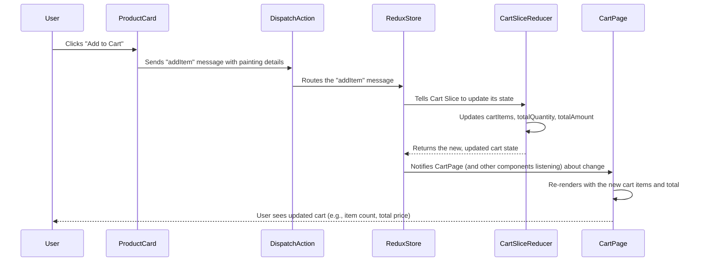

# Chapter 3: Shopping Cart Management (Redux)

Welcome back, art enthusiasts! In our [previous chapter on Product Catalog & Display](02_product_catalog___display_.md), we learned how to beautifully showcase all the art pieces in JMC-Store. Now that our visitors can admire and browse paintings, the natural next step is to let them gather the pieces they love and prepare for purchase. This is where our "Shopping Cart Management" comes into play.

### What is Shopping Cart Management?

Imagine you're walking through a physical art gallery, and you see several paintings you'd like to buy. You'd probably pick up a basket or ask an assistant to hold them for you. This basket holds your selected items, keeps track of how many you want, and helps you see the running total price.

Our "Shopping Cart" in JMC-Store is exactly this, but in a digital form. It's a virtual basket that remembers all the art pieces a customer wants to buy.

**The main problem it solves:** How do we efficiently store and instantly update a user's chosen items, their quantities, and the total cost across different parts of our website? If a user adds an item on the "Store" page, we need the "Cart" page and even a little number in the "Header" to instantly reflect that change.

Let's consider a common scenario: A customer is browsing our beautiful paintings. They see one they love, click "Add to Cart," and expect to see their virtual basket instantly update with the new item and an accurate total price. If they later go to the "Cart" page, they should see all their chosen items clearly listed.

To handle this efficiently, especially in larger applications, we use a powerful tool called **Redux**.

### Why Redux? (The "Central Brain")

You might wonder, "Why can't we just use what we learned about in previous chapters to manage the cart?" We could, for example, use `useState` in a component. But what if the "Add to Cart" button is on the `ProductCard` component, the cart icon with the item count is in the `Header` component, and the full list is on the `Cart` page component? These are all separate components. How do they all share and update the same cart information instantly without passing data through many layers?

This is where Redux comes in. Think of Redux as the **"Central Brain"** or a **"Digital Ledger"** for your application's important information. Instead of each part of your website trying to manage its own piece of data, Redux provides one single, consistent place where all important shared information (like our shopping cart) lives.

Here are the key ideas of Redux:

#### 1. The Store: The Single Source of Truth

At the heart of Redux is the **"Store."** This is like the main vault or the definitive ledger where all your application's shared data is kept. In JMC-Store, our shopping cart's items, total quantity, and total amount are all stored here. There's only one Store in a Redux application, making it easy to know where to look for data.

#### 2. Slices: Organizing the Data

The Store can hold a lot of different information (user details, product categories, etc.). To keep things organized, Redux helps us break down our data into smaller, manageable pieces called **"Slices."** For our shopping cart, we'll have a `cartSlice`. This slice specifically manages everything related to the shopping cart.

A slice defines:
*   `initialState`: What the data looks like when the application first starts (e.g., an empty cart, total quantity 0).
*   `reducers`: These are special functions that describe *how* the data can be changed. They are the *only* way to change the data in the Store. For our cart, we'll have reducers like `addItem` (to add a painting) and `deleteItem` (to remove one).

#### 3. Actions: Sending Messages to the Store

When something happens that needs to change the Store's data (like a user clicking "Add to Cart"), we don't change the data directly. Instead, we send a **"message"** to the Store. This message is called an **"Action."** An action is a simple object that describes *what happened* (e.g., "An item was added") and *any relevant information* (e.g., "The item added was the 'Blue Abstract' painting with ID 'p123'").

#### 4. Dispatching: Sending the Message

To send an Action message to the Redux Store, we use a special function called `dispatch`. When you click "Add to Cart," our code will `dispatch` an `addItem` action.

#### 5. Selectors: Reading Information

To get information *from* the Redux Store (like displaying the current total items in the cart icon or listing all items on the Cart page), we use **"Selectors."** Selectors are like asking the Store, "Hey, what's the current list of items in the cart?" or "What's the total price right now?". Selectors simply *read* data; they don't change it.

### How JMC-Store Uses Redux for Shopping Cart Management

Let's see how these Redux concepts come together in JMC-Store.

#### 1. Setting Up the Redux Store (`src/redux/store.js`)

First, we create our central Redux Store. This file tells Redux which "slices" of data our application will manage.

```javascript
// File: jmc-ecom/src/redux/store.js
import { configureStore } from '@reduxjs/toolkit'; // Helper to set up the store
import cartSlice from './slices/cartSlice'; // Our cart's data manager

const store = configureStore({
  reducer: {
    cart: cartSlice, // We tell the store that 'cart' data will be managed by 'cartSlice'
  },
});

export default store;
```
**Explanation:**
*   `configureStore` is a function from Redux Toolkit (a helpful package for Redux) that makes setting up the Store easy.
*   The `reducer` property is like a map, connecting a name (`cart` in this case) to its corresponding "slice" (`cartSlice`). This means any part of our app can ask the Store for `state.cart` to get cart information.

#### 2. Defining the Cart Logic (`src/redux/slices/cartSlice.js`)

This is where we define what our cart data looks like initially and how it can be changed.

```javascript
// File: jmc-ecom/src/redux/slices/cartSlice.js (Simplified core logic)
import { createSlice } from '@reduxjs/toolkit';

const initialState = {
  cartItems: [],      // An empty list to hold the paintings
  totalAmount: 0,     // The total price of all items
  totalQuantity: 0,   // The total count of all items (e.g., 2 shirts + 1 hat = 3 totalQuantity)
};

const cartSlice = createSlice({
  name: 'cart',       // A name for this slice (useful for debugging)
  initialState,       // The starting state for our cart
  reducers: {         // Functions that define how the state can be changed

    addItem: (state, action) => {
      const newItem = action.payload; // This is the painting data being added

      // Check if the painting is already in the cart
      const existingItem = state.cartItems.find((item) => item.id === newItem.id);

      if (!existingItem) {
        // If it's a completely new painting, add it to the list with quantity 1
        state.cartItems.push({ ...newItem, quantity: 1, totalPrice: newItem.price });
      } else {
        // If it's already there, just increase its quantity and update its total price
        existingItem.quantity++;
        existingItem.totalPrice = existingItem.totalPrice + Number(newItem.price);
      }

      // After any change, recalculate the total quantity and total amount from scratch
      state.totalQuantity = state.cartItems.reduce((total, item) => total + item.quantity, 0);
      state.totalAmount = state.cartItems.reduce((total, item) => total + (item.price * item.quantity), 0);
    },

    deleteItem: (state, action) => {
      const id = action.payload; // This is the ID of the painting to remove
      const existingItem = state.cartItems.find((item) => item.id === id);

      if (existingItem) {
        // Remove the item from the cartItems list
        state.cartItems = state.cartItems.filter((item) => item.id !== id);
        // Adjust the total quantity by subtracting the removed item's quantity
        state.totalQuantity = state.totalQuantity - existingItem.quantity;
      }
      // Recalculate the total amount after removal
      state.totalAmount = state.cartItems.reduce((total, item) => total + (item.price * item.quantity), 0);
    },
  },
});

export const cartActions = cartSlice.actions; // Export actions so components can use them
export default cartSlice.reducer; // Export the reducer for the Store
```
**Explanation:**
*   `createSlice` helps us define the `name`, `initialState`, and `reducers` for our cart.
*   `addItem` is a reducer function. It receives the current `state` (our cart's data) and the `action` (the message, including the new item). It checks if the item is already there. If not, it adds it with `quantity: 1`. If yes, it just increases the `quantity` for that existing item. Importantly, it also updates the `totalQuantity` and `totalAmount` by summing up all current items and their quantities.
*   `deleteItem` is another reducer. It finds the item to be removed by its `id` and filters it out of the `cartItems` list. Then, it also updates `totalQuantity` and `totalAmount` accordingly.
*   `cartActions` is automatically generated by `createSlice` and lets us easily access our `addItem` and `deleteItem` actions from other parts of our application (like `cartActions.addItem`).

#### 3. Adding to Cart from a Product Card (`src/components/UI/ProductCard.jsx`)

When a user clicks "Add to Cart" on a painting, the `ProductCard` component needs to tell the Redux Store to update.

```javascript
// File: jmc-ecom/src/components/UI/ProductCard.jsx (Excerpt)
import { useDispatch } from 'react-redux'; // Tool to send messages
import { cartActions } from '../../redux/slices/cartSlice'; // Our cart messages
import { toast } from 'react-toastify'; // For the "Added To Cart" message

const ProductCard = ({ item }) => {
  const dispatch = useDispatch(); // Get the special 'dispatcher' function

  const addToCart = () => {
    dispatch( // Send a message to the Redux Store!
      cartActions.addItem({ // The message is 'addItem'
        // The information sent with the message (the painting's details)
        id: item.id,
        productName: item.productName,
        price: item.price,
        imgUrl: item.imgUrl,
      })
    );
    toast.success('Added To Cart'); // Show a small success pop-up
  };

  return (
    // ... other ProductCard JSX
    <motion.span whileHover={{ scale: 1.5 }} onClick={addToCart}>
      <i className="ri-add-circle-fill"></i> {/* The "add" icon */}
    </motion.span>
    // ...
  );
};
export default ProductCard;
```
**Explanation:**
*   `useDispatch()` is a special Redux tool that gives us the `dispatch` function.
*   When the "add" icon is clicked, the `addToCart` function is called.
*   Inside `addToCart`, we `dispatch` the `cartActions.addItem` action, passing all the necessary details of the painting (`id`, `productName`, etc.) that the `addItem` reducer in `cartSlice` will use.
*   This triggers the `addItem` reducer, updating the cart's state in the central Redux Store.

#### 4. Displaying and Managing the Cart (`src/pages/Cart.jsx`)

The `Cart` page needs to read the current cart items and total amount from the Redux Store and allow users to delete items.

```javascript
// File: jmc-ecom/src/pages/Cart.jsx (Excerpt for displaying cart)
import { useSelector, useDispatch } from 'react-redux'; // Tools to read and send messages
import { cartActions } from '../redux/slices/cartSlice'; // Our cart messages
import { Link } from 'react-router-dom';

const Cart = () => {
  // Use 'useSelector' to read the cart items and total amount from the Redux Store
  const cartItems = useSelector((state) => state.cart.cartItems);
  const totalAmount = useSelector((state) => state.cart.totalAmount);

  return (
    // ... other JSX for page layout
    <Col lg="9" className="cart__empty">
      {cartItems.length === 0 ? (
        <h2 className="fs-4 text-center">Nothing here yet...</h2>
      ) : (
        <table className="table bordered">
          <thead>
            <tr>
              <th>Title</th>
              <th>Price</th>
              <th>Qty</th>
              <th>Delete</th>
            </tr>
          </thead>
          <tbody>
            {/* For each item in cartItems, create a table row using the Tr component */}
            {cartItems.map((item, index) => (
              <Tr item={item} key={index} />
            ))}
          </tbody>
        </table>
      )}
    </Col>
    <Col lg="3">
      <div>
        <h6>Subtotal</h6>
        <span className="fs-4 fw-bold">${totalAmount}</span> {/* Display the total amount */}
        <p className="fs-6 mt-2">taxes and shipping will be calculated at checkout</p>
      </div>
      <div>
        <Link to="/store">Continue Shopping</Link>
        <Link to="/checkout">Checkout</Link>
      </div>
    </Col>
    // ...
  );
};
```
**Explanation:**
*   `useSelector()` is a powerful Redux tool that lets a component "subscribe" to specific pieces of data in the Store. When that data changes, the component automatically re-renders with the new information.
*   Here, we use `useSelector` to grab `state.cart.cartItems` (the list of paintings in the cart) and `state.cart.totalAmount` (the calculated total price).
*   The `cartItems` list is then used to render each painting in a table row using a helper `Tr` component.

```javascript
// File: jmc-ecom/src/pages/Cart.jsx (Excerpt for a single cart item row)
// Helper component for each row in the cart table
const Tr = ({ item }) => {
  const dispatch = useDispatch(); // Need dispatch to remove items

  const deleteProduct = () => {
    dispatch(cartActions.deleteItem(item.id)); // Send the 'deleteItem' message with the item's ID
  };

  return (
    <tr>
      <td>{item.productName}</td>
      <td>{item.price}</td>
      <td>{item.quantity}</td> {/* Display item quantity */}
      <motion.td onClick={deleteProduct} whileTap={{ scale: 1.5 }}>
        <i className="ri-delete-bin-line"></i> {/* Delete icon */}
      </motion.td>
    </tr>
  );
};
```
**Explanation:**
*   The `Tr` component displays the details of a single item in the cart.
*   When the delete icon is clicked, it `dispatch`es the `cartActions.deleteItem` action, telling the Redux Store to remove this specific item.

### How It All Works Together (Under the Hood)

Let's trace what happens when a user adds a painting to their cart:



In summary:
1.  When a user interacts with a component (like clicking "Add to Cart" on a `ProductCard`), that component doesn't directly change the cart data.
2.  Instead, it `dispatch`es an **Action** (a message) to the central Redux **Store**, describing what happened (`addItem`).
3.  The Redux Store receives this message and, based on its configuration, knows which **Reducer** (in our `cartSlice`) is responsible for handling this type of action.
4.  The Reducer then receives the `state` (the current cart data) and the `action`'s information, and it produces a *new* version of the `state` with the updates (e.g., the new item added, quantities updated).
5.  The Redux Store updates its central record with this new state.
6.  Any component that is "listening" to that part of the Store's data using `useSelector` (like our `Cart` page or a cart icon in the `Header`) automatically re-renders to show the latest information.

This structured approach ensures that our shopping cart data is always consistent, easy to manage, and updates instantly across all parts of the JMC-Store website!

### Conclusion

In this chapter, we learned about "Shopping Cart Management" and how Redux acts as the powerful "Central Brain" for our JMC-Store's dynamic data. We explored the core concepts of Redux: the central "Store," organized "Slices" with their "Reducers," sending "Actions" with `dispatch`, and reading data with `useSelector`. By using Redux, JMC-Store can efficiently manage the digital shopping basket, ensuring that items, quantities, and total prices are always up-to-date and accessible from any part of the website.

Now that customers can fill their virtual shopping carts with beautiful art, the next crucial step is to allow them to pay for their selections! In the next chapter, we'll dive into how JMC-Store integrates with a payment system to handle transactions.

[Next Chapter: Stripe Payment Integration](04_stripe_payment_integration_.md)

---

<sub><sup>Generated by [AI Codebase Knowledge Builder](https://github.com/The-Pocket/Tutorial-Codebase-Knowledge).</sup></sub> <sub><sup>**References**: [[1]](https://github.com/mhwebdevelopment/JMC-Store/blob/5458d78fa64e6f4f059a9638e7380066efb83ac3/jmc-ecom/src/components/UI/ProductCard.jsx), [[2]](https://github.com/mhwebdevelopment/JMC-Store/blob/5458d78fa64e6f4f059a9638e7380066efb83ac3/jmc-ecom/src/pages/Cart.jsx), [[3]](https://github.com/mhwebdevelopment/JMC-Store/blob/5458d78fa64e6f4f059a9638e7380066efb83ac3/jmc-ecom/src/redux/slices/cartSlice.js), [[4]](https://github.com/mhwebdevelopment/JMC-Store/blob/5458d78fa64e6f4f059a9638e7380066efb83ac3/jmc-ecom/src/redux/store.js)</sup></sub>