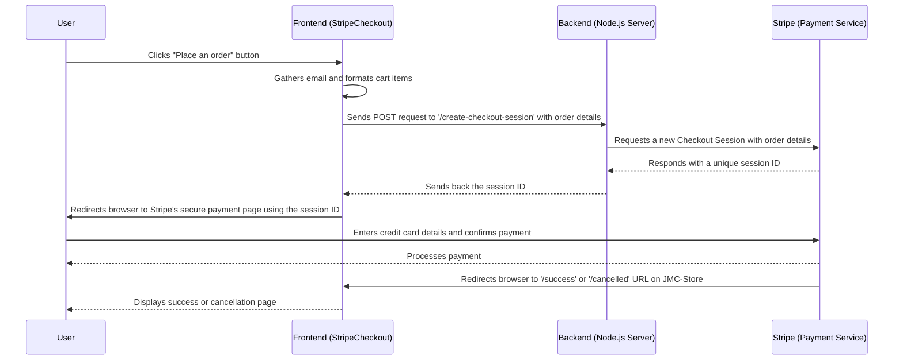

# Chapter 4: Stripe Payment Integration

Welcome back to the JMC-Store journey! In our [previous chapter on Shopping Cart Management (Redux)](03_shopping_cart_management__redux__.md), we learned how to let customers add beautiful art pieces to their virtual shopping carts. Now that their carts are full, the most exciting (and crucial!) step is to let them complete their purchase. This is where "Stripe Payment Integration" comes in.

### What is Stripe Payment Integration?

Imagine our JMC-Store as a bustling art gallery. You've picked out a few paintings and now you're at the counter, ready to pay. You don't hand your credit card directly to a stranger; you use a secure card reader. This card reader, and the system behind it that safely handles your money, is like Stripe.

**Stripe Payment Integration** is the process of connecting our website to **Stripe**, a very popular and secure online payment processing service. It acts as our website's **secure cashier**.

**The main problem it solves:** How do we safely and reliably collect money from our customers without handling sensitive credit card details ourselves? We want to ensure that payment information is handled with the highest security and that transactions (like buying a painting) are processed smoothly and reliably.

Let's take a common scenario: A customer has finished adding items to their cart and is ready to pay. They click "Checkout." Our system needs to:

*   Collect the necessary information for the payment (like the total amount and items).
*   Hand over the sensitive payment details (like credit card numbers) to a super-secure third party.
*   Process the payment.
*   Confirm if the payment was successful or if there was an issue.

This chapter will guide you through how JMC-Store achieves this using Stripe.

### Key Concepts for Online Payments

Handling money online involves a few important steps and responsibilities:

#### 1. Client-Side (Frontend) Interaction: Your Website's Role

This is what the customer sees and interacts with. On our JMC-Store, it means:

*   Displaying the cart summary (total items, total price) on the checkout page.
*   Gathering basic customer information (like their email).
*   **Crucially, it does NOT collect credit card numbers directly.** Instead, it prepares the order details (what items, how much) and sends them securely to our backend server.

#### 2. Server-Side (Backend) Communication: The Secure Bridge

Why do we need a backend server for payments? Think of it as the secure office behind the cashier counter.

*   **Security:** Your secret keys for communicating with Stripe must *never* be exposed on the frontend (in the user's browser). If they were, anyone could use them to make transactions on your behalf! The backend keeps these keys safe.
*   **Trust:** The backend acts as a trusted intermediary. It receives the order details from the frontend, uses its secret key to talk directly to Stripe's secure servers, and requests a "checkout session" for that specific order.

#### 3. The Secure Payment Flow: Letting Stripe Take Over

Once our backend has set up a "checkout session" with Stripe:

*   Stripe gives us a unique ID for that session.
*   Our frontend then *redirects* the customer's browser directly to a secure, Stripe-hosted payment page. This is where the customer enters their sensitive credit card details.
*   Stripe handles *all* the sensitive information and the actual payment processing (checking funds, debiting the card, etc.).
*   After the payment is complete (or cancelled), Stripe automatically redirects the customer *back* to our website, to either a "success" page or a "cancelled" page.

### How JMC-Store Handles Payments (Solving the Use Case)

Let's trace how JMC-Store implements this secure payment process.

#### 1. The Checkout Page (`src/pages/Checkout.jsx`)

This is the page where customers finalize their order. It simply displays the total cost and includes our special `StripeCheckout` component.

```javascript
// File: jmc-ecom/src/pages/Checkout.jsx (Simplified)
import React from 'react';
import { Container, Row, Col } from 'reactstrap';
import StripeCheckout from '../components/StripeCheckout'; // Our special component
import { useSelector } from 'react-redux'; // To get cart data from Redux

const Checkout = () => {
  // Read total quantity and total amount from our Redux cart store
  const totalQty = useSelector((state) => state.cart.totalQuantity);
  const totalAmount = useSelector((state) => state.cart.totalAmount);

  return (
    <section>
      <Container>
        <Row>
          <Col lg="4"> {/* Column for payment details */}
            <div className="checkout__cart">
              <h6>Total Qty: <span>{totalQty} items</span></h6>
              <h6>Subtotal: <span>${totalAmount}</span></h6>
              {/* ... other pricing details ... */}
              <h4>Total Cost: <span>${totalAmount}</span></h4>
              <StripeCheckout /> {/* This is where the magic happens! */}
            </div>
          </Col>
        </Row>
      </Container>
    </section>
  );
};
export default Checkout;
```
**Explanation:**
*   The `Checkout` page uses `useSelector` (from [Shopping Cart Management (Redux)](03_shopping_cart_management__redux__.md)) to display the order summary.
*   It then simply renders the `<StripeCheckout />` component, which will handle the actual payment process.

#### 2. The `StripeCheckout` Component (`src/components/StripeCheckout.jsx`)

This component is where our frontend logic for initiating the Stripe payment lives.

```javascript
// File: jmc-ecom/src/components/StripeCheckout.jsx (Simplified core logic)
import React, { useState } from 'react';
import { useStripe } from '@stripe/react-stripe-js'; // Stripe tool for frontend
import { useSelector } from 'react-redux'; // To get cart data
import { fetchFromAPI } from '../helper'; // Our helper for API calls

const StripeCheckout = () => {
  const [email, setEmail] = useState('');
  const cartItems = useSelector((state) => state.cart.cartItems); // Get items from Redux
  const stripe = useStripe(); // Get the Stripe object for redirection

  const handleGuestCheckout = async (e) => {
    e.preventDefault();

    // 1. Format cart items for Stripe
    const line_items = cartItems.map((item) => ({
      quantity: item.quantity,
      price_data: {
        currency: 'usd',
        unit_amount: item.price * 100, // Stripe expects amount in cents!
        product_data: { name: item.productName },
      },
    }));

    // 2. Call our backend to create a Stripe Checkout Session
    const response = await fetchFromAPI('create-checkout-session', {
      body: { line_items, customer_email: email },
    });
    const { sessionId } = response; // Get the session ID from our backend

    // 3. Redirect to Stripe's hosted checkout page
    const { error } = await stripe.redirectToCheckout({ sessionId });
    if (error) { console.log(error); } // Handle errors
  };

  return (
    <form onSubmit={handleGuestCheckout}>
      <div className="form__group mt-4">
        <input
          type="email"
          onChange={(e) => setEmail(e.target.value)}
          placeholder="Enter your email"
          value={email}
        />
      </div>
      <div>
        <button type="submit">Place an order</button>
      </div>
    </form>
  );
};
export default StripeCheckout;
```
**Explanation:**
*   `useStripe()` is a special tool from `@stripe/react-stripe-js` that gives us a Stripe object we can use to redirect the user to Stripe's payment page. (Note: For `useStripe()` to work, our main application needs to be wrapped with Stripe's `<Elements>` component, which is typically done higher up in the application's root for setup.)
*   When the "Place an order" button is clicked, `handleGuestCheckout` runs.
*   **Step 1:** It transforms the `cartItems` (from [Shopping Cart Management (Redux)](03_shopping_cart_management__redux__.md)) into a `line_items` format that Stripe understands. Notice `item.price * 100` because Stripe works with the smallest currency unit (cents for USD).
*   **Step 2:** It uses `fetchFromAPI` to send these `line_items` and the customer `email` to our backend server, asking it to create a Stripe checkout session.
*   **Step 3:** Once our backend responds with a `sessionId`, `stripe.redirectToCheckout({ sessionId })` is called. This automatically takes the user's browser to Stripe's secure payment page.

The `fetchFromAPI` function is a simple helper to make HTTP requests to our backend:

```javascript
// File: jmc-ecom/src/helper.js (Simplified)
const API = process.env.REACT_APP_API_URL; // Our backend server's address

export async function fetchFromAPI(endpoint, opts) {
  const { method, body } = { method: 'POST', body: null, ...opts };
  const res = await fetch(`${API}/${endpoint}`, {
    method,
    ...(body && { body: JSON.stringify(body) }), // Send data as JSON
    headers: { 'Content-Type': 'application/json' },
  });
  return res.json();
}
```
**Explanation:**
*   This function just makes it easier to send POST requests (with JSON data) to specific `endpoint`s on our `API` (our backend server).

#### 3. The Backend's Role (`server` folder files)

Our backend server (built with Node.js and Express) is the secure bridge to Stripe.

**a. Setting up the Server (`server/index.js`)**

This file sets up our basic web server and defines the specific "path" or "route" that our frontend will call for Stripe checkout.

```javascript
// File: server/index.js (Simplified)
const express = require('express');
const cors = require('cors');
require('dotenv').config({ path: './.env' }); // Load secret keys
const createCheckoutSession = require('./api/checkout'); // Our Stripe logic

const app = express();
const port = process.env.PORT; // Port for our backend server

app.use(express.json()); // Allows parsing JSON from requests
app.use(cors({ origin: true })); // Allows frontend (different origin) to talk to backend

// When frontend sends a POST request to /create-checkout-session,
// call the createCheckoutSession function
app.post('/create-checkout-session', createCheckoutSession);

app.listen(port, () => console.log('server listening on port', port));
```
**Explanation:**
*   `app.post('/create-checkout-session', createCheckoutSession);` is the key line. It says: "When someone sends a `POST` request to the `/create-checkout-session` address, run the `createCheckoutSession` function." This is the API endpoint our frontend calls.

**b. The Core Stripe Logic (`server/api/checkout.js`)**

This file contains the function that directly talks to Stripe.

```javascript
// File: server/api/checkout.js (Simplified core logic)
const stripeAPI = require('../stripe'); // Our initialized Stripe object
require('dotenv').config({ path: '../.env' });

async function createCheckoutSession(req, res) {
  const domainUrl = process.env.CLIENT_DOMAIN; // Our frontend's website address
  const { line_items, customer_email } = req.body; // Data sent from frontend

  let session;
  try {
    session = await stripeAPI.checkout.sessions.create({
      payment_method_types: ['card'], // We accept card payments
      mode: 'payment', // This is for a one-time payment
      line_items, // The items being purchased (formatted by frontend)
      customer_email, // Customer's email
      success_url: `${domainUrl}/success?session_id={CHECKOUT_SESSION_ID}`, // Redirect after success
      cancel_url: `${domainUrl}/cancelled`, // Redirect after cancel
      shipping_address_collection: { allowed_countries: ['US'] }, // Collect shipping address
      shipping_options: [{ shipping_rate: 'shr_1MYWlUA0AImmhFD7WfAvkoBn' }],
    });
    res.status(200).json({ sessionId: session.id }); // Send session ID back to frontend
  } catch (error) {
    console.log(error);
    res.status(400).json({ error: 'an error occured' });
  }
}
module.exports = createCheckoutSession;
```
**Explanation:**
*   This function receives the `line_items` and `customer_email` from our frontend.
*   `stripeAPI.checkout.sessions.create()` is the most important part: it's how our backend tells Stripe to create a unique checkout experience.
    *   `payment_method_types: ['card']` specifies we accept credit cards.
    *   `mode: 'payment'` means it's a one-time purchase.
    *   `success_url` and `cancel_url` tell Stripe where to send the user *back* on our website after they finish or cancel the payment on Stripe's page.
*   If successful, Stripe returns a `session` object, and we extract its `id` (`sessionId`) and send it back to our frontend.

**c. Initializing Stripe (`server/stripe.js`)**

This tiny file simply sets up our connection to Stripe using our secret key.

```javascript
// File: server/stripe.js
const stripeAPI = require('stripe')(process.env.STRIPE__SECRET__KEY);
module.exports = stripeAPI;
```
**Explanation:**
*   `process.env.STRIPE__SECRET__KEY` is our secret key, loaded from a `.env` file, which *never* gets shared publicly. This is why the backend is essential for secure Stripe communication.

### How It All Works Together (Under the Hood)

Let's see the full journey when a customer wants to check out their cart:



In summary:
1.  The **User** clicks "Place an order" on our JMC-Store's **Frontend** (`StripeCheckout` component).
2.  The **Frontend** formats the items from the [Shopping Cart Management (Redux)](03_shopping_cart_management__redux__.md) store and sends them, along with the user's email, to our **Backend Server**.
3.  The **Backend Server** uses its secret Stripe key to communicate directly with **Stripe's** secure service, requesting a new "checkout session" for these items.
4.  **Stripe** creates this session and sends back a unique `sessionId` to our **Backend**.
5.  Our **Backend** sends this `sessionId` back to our **Frontend**.
6.  The **Frontend** then uses this `sessionId` to tell the user's browser to `redirectToCheckout`, which means redirecting the user *directly to Stripe's own secure payment page*.
7.  The **User** enters their credit card details *on Stripe's website*, ensuring their sensitive information never touches our servers.
8.  After the payment is processed by **Stripe**, **Stripe** automatically redirects the user's browser back to our JMC-Store website (either the `/success` or `/cancelled` page, depending on the outcome).

This multi-step process, with Stripe handling the sensitive details, makes online payments secure and reliable for JMC-Store.

### Conclusion

In this chapter, we learned how JMC-Store securely processes payments using "Stripe Payment Integration." We explored how Stripe acts as our website's secure cashier, handling all sensitive payment information. We saw the crucial roles of the frontend (preparing the order), the backend (securely communicating with Stripe and setting up the checkout session), and Stripe itself (collecting card details and processing the payment). This system ensures that our customers can confidently purchase beautiful art, knowing their financial transactions are safe.

Now that we can manage our art catalog, handle shopping carts, and process payments, a key piece of the puzzle is where all this art data is actually stored and managed. In the next chapter, we'll dive into how JMC-Store uses "Firebase Backend" to store and retrieve all its important information.

[Next Chapter: Firebase Backend](05_firebase_backend_.md)

---

<sub><sup>Generated by [AI Codebase Knowledge Builder](https://github.com/The-Pocket/Tutorial-Codebase-Knowledge).</sup></sub> <sub><sup>**References**: [[1]](https://github.com/mhwebdevelopment/JMC-Store/blob/5458d78fa64e6f4f059a9638e7380066efb83ac3/jmc-ecom/src/components/StripeCheckout.jsx), [[2]](https://github.com/mhwebdevelopment/JMC-Store/blob/5458d78fa64e6f4f059a9638e7380066efb83ac3/jmc-ecom/src/helper.js), [[3]](https://github.com/mhwebdevelopment/JMC-Store/blob/5458d78fa64e6f4f059a9638e7380066efb83ac3/jmc-ecom/src/pages/Checkout.jsx), [[4]](https://github.com/mhwebdevelopment/JMC-Store/blob/5458d78fa64e6f4f059a9638e7380066efb83ac3/server/api/checkout.js), [[5]](https://github.com/mhwebdevelopment/JMC-Store/blob/5458d78fa64e6f4f059a9638e7380066efb83ac3/server/index.js), [[6]](https://github.com/mhwebdevelopment/JMC-Store/blob/5458d78fa64e6f4f059a9638e7380066efb83ac3/server/stripe.js)</sup></sub>