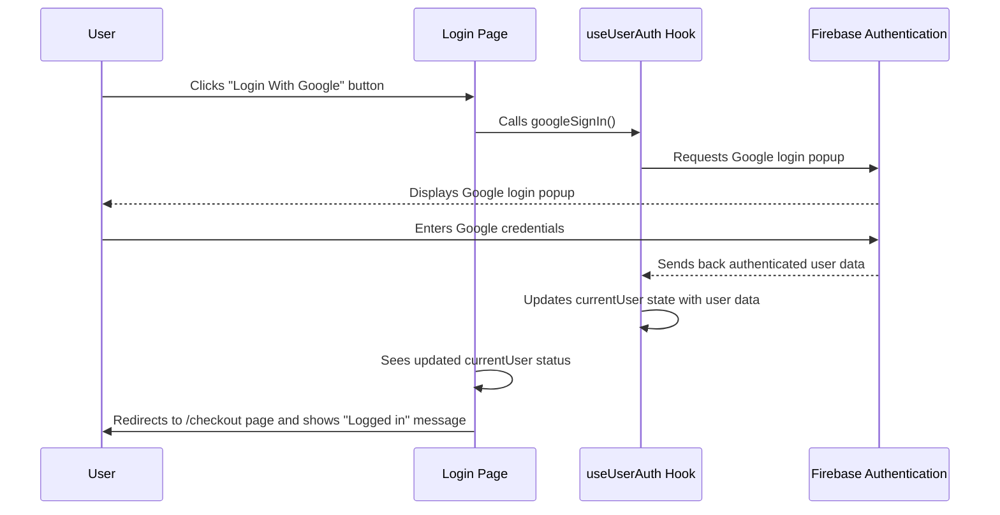
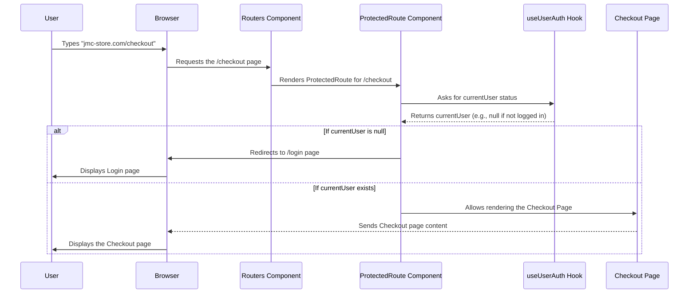

# Chapter 6: User Authentication & Authorization

Welcome back to the JMC-Store tutorial! In our [previous chapter on Firebase Backend](05_firebase_backend_.md), we learned where all our store's valuable data (like paintings and user profiles) is stored and how we retrieve it. A crucial part of managing user profiles is handling how people sign up and log in. This is where "User Authentication & Authorization" comes in.

### What is User Authentication & Authorization?

Imagine our JMC-Store as a grand art gallery.

*   **User Authentication** is like the **gallery's reception desk**. It's the process of verifying who you are. When you enter the gallery, you might show your ID or a special pass to prove you're a registered visitor. On a website, this means managing how users create an account (sign up) and prove their identity (log in). JMC-Store simplifies this by only allowing logins via **Google**, making it super easy and secure.

*   **User Authorization** is like the **gallery's security control**. After you've shown your ID at the reception (authenticated), the security control decides which rooms you're allowed to enter. Are you a regular visitor allowed in all public exhibition halls? Are you an artist with access to the private studios? Or are you an admin with keys to all staff-only areas? On a website, this means determining what parts of the application a user can access and what actions they can perform based on their "role" (e.g., regular user, artist, or admin).

**The main problem they solve:** How do we safely know *who* is using our website and *what they are allowed to do*? We want to ensure that only registered users can access certain features (like checking out), and that special areas (like the Admin Dashboard) are only accessible to the right people.

Let's consider a common scenario: A new user wants to browse our paintings and eventually make a purchase. They need to sign up and log in. After logging in, we want to ensure they can access their shopping cart and checkout page, but not the special "Admin Dashboard" where we manage new paintings. Authentication proves who they are, and authorization ensures they only see what they're supposed to.

### Key Concepts for Secure Access

To manage who can access our JMC-Store and what they can do, we rely on a few core concepts and tools provided by **Firebase Authentication** (which we introduced in the [Firebase Backend](05_firebase_backend_.md) chapter).

#### 1. Signing In & Signing Up (Authentication)

This is how users get access to the website. JMC-Store exclusively uses **Google Sign-In (OAuth)** for simplicity and security. Instead of users creating new passwords just for our site, they use their existing Google account.

*   **GoogleAuthProvider**: This is a special tool from Firebase that allows us to connect with Google's login system.
*   **signInWithPopup**: When a user clicks "Login with Google", this Firebase function opens a small Google login window. Once they log in successfully with Google, Firebase tells our app, "Hey, this user is now authenticated!".

#### 2. Knowing Who's Logged In (`onAuthStateChanged`)

After a user logs in (or logs out), our application needs to know their current status.

*   **onAuthStateChanged**: This is a powerful Firebase feature that continuously "listens" for changes in the user's login status. If a user logs in, logs out, or their session expires, `onAuthStateChanged` immediately tells our app, giving us the latest user information. This means our "Login" button can instantly change to "Logout" or show the user's profile icon.

#### 3. Protecting Pages (Basic Authorization)

Once we know who is logged in, we can control access to certain parts of the website.

*   **Protected Routes**: These are special pathways in our website that require a user to be logged in to access them. If a user tries to visit a protected page without logging in, they are automatically sent to the login page.

*   **User Roles (for deeper Authorization)**: While `ProtectedRoute` ensures someone is *logged in*, for advanced authorization (like distinguishing between regular users, artists, and admins), we would also check the user's "role". This role information isn't directly part of the basic Firebase login but would be stored in our Firestore Database (as discussed in [Firebase Backend](05_firebase_backend_.md)) and retrieved after a user logs in. For example, after a user logs in, we might check our `users` collection in Firestore to see if their `uid` (unique user ID from Firebase Auth) is marked with `role: 'admin'`.

### How JMC-Store Handles Authentication & Authorization

Let's see how these concepts are put into practice in JMC-Store.

#### 1. The `useAuth` Hook: Our User Status Tracker (`src/custom-hooks/useAuth.js`)

This custom React hook is the central place for all user authentication logic. It connects our app to Firebase Authentication.

```javascript
// File: jmc-ecom/src/custom-hooks/useAuth.js (Simplified)
import { createContext, useContext, useEffect, useState } from 'react';
import {
  onAuthStateChanged,    // To know if a user is logged in
  GoogleAuthProvider,    // For Google login
  signInWithPopup,       // For pop-up logins (like Google)
  signOut,               // For logging out
} from 'firebase/auth';
import { auth } from '../firebase.config'; // Our Firebase Auth tool

const userAuthContext = createContext(); // To share user info across components

export function UserAuthContextProvider({ children }) {
  const [currentUser, setCurrentUser] = useState(null); // Stores the logged-in user

  function googleSignIn() {
    const googleAuthProvider = new GoogleAuthProvider(); // Create Google login provider
    return signInWithPopup(auth, googleAuthProvider); // Show Google login popup
  }

  function logOut() {
    return signOut(auth); // Log out the current user
  }

  useEffect(() => {
    // This function automatically runs when login/logout status changes
    const unsubscribe = onAuthStateChanged(auth, (user) => {
      if (user) {
        setCurrentUser(user); // If user is logged in, store their info
      } else {
        setCurrentUser(null); // If no user, set to null
      }
    });
    return () => {
      unsubscribe(); // Stop listening when component unmounts
    };
  }, []); // Runs only once when the app starts

  return (
    <userAuthContext.Provider
      value={{ currentUser, googleSignIn, logOut }} // Make these available
    >
      {children}
    </userAuthContext.Provider>
  );
}

export function useUserAuth() {
  return useContext(userAuthContext); // A simpler way to use the context
}
```
**Explanation:**
*   The `UserAuthContextProvider` "wraps" our entire application (typically in `index.js`), making the `currentUser`, `googleSignIn`, and `logOut` functions available to any component that needs them.
*   `currentUser` holds the information about the currently logged-in user (or `null` if no one is logged in).
*   `onAuthStateChanged` is the "listener" that updates `currentUser` whenever the user's login status changes. This is why our header's user icon or profile links update automatically.
*   `googleSignIn()` handles the actual process of popping up the Google login window.

#### 2. Logging In/Signing Up with Google (`src/pages/Login.jsx`, `src/pages/Signup.jsx`)

Both the login and signup pages in JMC-Store offer a simple "Login With Google" or "Signup With Google" button. They use the `googleSignIn` function from our `useAuth` hook.

```javascript
// File: jmc-ecom/src/pages/Login.jsx (Simplified for Google Login)
import React from 'react';
import { Link, useNavigate } from 'react-router-dom';
import { useUserAuth } from '../custom-hooks/useAuth'; // Our user authentication hook
import { toast } from 'react-toastify'; // For messages

const Login = () => {
  const { googleSignIn } = useUserAuth(); // Get the Google sign-in function
  const navigate = useNavigate();

  const handleGoogleSignIn = async (e) => {
    e.preventDefault();
    try {
      await googleSignIn(); // Call the Google sign-in function
      toast.success('Logged in successfully!');
      navigate('/checkout'); // Redirect to checkout page after login
    } catch (error) {
      toast.error('Something went wrong with Google login.');
      console.error(error);
    }
  };

  return (
    <section>
      {/* ... other page content ... */}
      <form onSubmit={handleGoogleSignIn}>
        <button type="submit">
          <i className="ri-google-fill"></i> Login With Google
        </button>
        <p>No account yet? <Link to="/signup">Signup</Link></p>
      </form>
    </section>
  );
};
export default Login;
```
**Explanation:**
*   `useUserAuth()` gives us access to `googleSignIn`.
*   When the button is clicked, `handleGoogleSignIn` calls `await googleSignIn()`, which triggers the Firebase Google login popup.
*   If successful, `toast.success` shows a message, and the user is `navigate`d to the `/checkout` page.

The `Signup.jsx` page works in an almost identical way, simply leading to a different redirect (`/home`) and showing a "signed up" toast message.

#### 3. Protecting Routes (`src/routers/ProtectedRoute.js`)

This special component is used in our main `Routers.js` (from [Frontend Routing & Layout](01_frontend_routing___layout_.md)) to make sure certain pages are only accessible to logged-in users.

```javascript
// File: jmc-ecom/src/routers/ProtectedRoute.js
import React from 'react';
import { useUserAuth } from '../custom-hooks/useAuth'; // To check current user
import { Navigate, Outlet } from 'react-router-dom'; // For navigation

const ProtectedRoute = () => {
  const { currentUser } = useUserAuth(); // Get the current user's status

  // If there is a 'currentUser' (meaning someone is logged in),
  // allow them to see the page they requested ('Outlet').
  // Otherwise, redirect them to the '/login' page.
  return currentUser ? <Outlet /> : <Navigate to="/login" />;
};
export default ProtectedRoute;
```
**Explanation:**
*   `currentUser` from `useUserAuth()` tells us if anyone is logged in.
*   `Outlet` is a component from React Router DOM that basically means "render the child routes here." So, if `currentUser` exists, the user can proceed to the requested page (like `/checkout` or `/dashboard`).
*   `Navigate to="/login"` is how we automatically redirect a user to the login page if they are *not* logged in and try to access a protected page.

For instance, our `/checkout` page is often wrapped by a `ProtectedRoute` in `Routers.js`:
```javascript
// Simplified excerpt from src/routers/Routers.js
import ProtectedRoute from './ProtectedRoute'; // Our guardian component

const Routers = () => {
  return (
    <Routes>
      {/* ... other routes ... */}
      <Route path="checkout" element={<ProtectedRoute />}>
        {/* Only logged-in users can see the Checkout page */}
        <Route path="" element={<Checkout />} />
      </Route>
      <Route path="login" element={<Login />} />
      {/* ... more protected routes for dashboard ... */}
    </Routes>
  );
};
```
This setup means if you try to go to `/checkout` and are not logged in, `ProtectedRoute` will send you to `/login`.

#### 4. Authorization by Role (Admin/Artist access)

While `ProtectedRoute` ensures a user is logged in, distinguishing between different *types* of logged-in users (like admins vs. regular users) requires an additional step.

In JMC-Store, after a user logs in via Google, we would typically check their `uid` (unique Firebase User ID) against a list of known admins or artists stored in our [Firestore Database](05_firebase_backend_.md).

For example, the `AdminNav` component in `src/admin/AdminNav.jsx` is rendered by `Layout.jsx` (from [Frontend Routing & Layout](01_frontend_routing___layout_.md)) only when the URL starts with `/dashboard`. This implies that access to these paths (like `/dashboard/add-product`, `/dashboard/users`) would also be guarded by `ProtectedRoute` or a more specific role check to ensure only actual admins can reach them.

```javascript
// File: jmc-ecom/src/admin/AdminNav.jsx (Simplified for context)
import { NavLink } from 'react-router-dom';
const admin__nav = [
  { display: 'Dashboard', path: '/dashboard', },
  { display: 'All Paintings', path: '/dashboard/all-products', },
  { display: 'Users', path: '/dashboard/users', },
  // ... only visible if user is authorized as admin
];
const AdminNav = () => {
  return (
    <section className="admin__menu p-0">
      <div className="admin__navigation">
        <ul className="admin__menu-list">
          {admin__nav.map((item, index) => (
            <li className="admin__menu-item" key={index}>
              <NavLink to={item.path}>{item.display}</NavLink>
            </li>
          ))}
        </ul>
      </div>
    </section>
  );
};
export default AdminNav;
```
**Explanation:**
*   This navigation menu displays links relevant only to administrators. While the provided code snippet for `Layout.jsx` in Chapter 1 just checks for `/dashboard` paths, in a full application, the `ProtectedRoute` or similar logic for dashboard paths would typically include an *additional* check against a user's role (e.g., `currentUser.role === 'admin'`) retrieved from Firestore after login, to ensure only actual admins can view these links and access these pages.

### How It All Works Together (Under the Hood)

Let's trace the journey of a user interacting with authentication and authorization.

#### Scenario 1: A User Logs In with Google


**Explanation:**
1.  The **User** clicks the "Login With Google" button on the **Login Page**.
2.  The **Login Page** calls the `googleSignIn()` function provided by our `useUserAuth` Hook.
3.  The `useUserAuth` Hook then uses Firebase Authentication to open a **Google login popup**.
4.  The **User** interacts directly with Google to log in.
5.  After successful Google login, **Firebase Authentication** sends the user's authenticated details back to our `useUserAuth` Hook.
6.  The `useUserAuth` Hook updates its internal `currentUser` state, notifying all parts of the app that are listening (like the `Login Page`).
7.  The **Login Page** then redirects the **User** to the `/checkout` page, now that they are logged in.

#### Scenario 2: A User Tries to Access a Protected Page (e.g., /checkout)


**Explanation:**
1.  The **User** tries to navigate to a protected page (like `/checkout`) in their **Browser**.
2.  Our main **Routers Component** sees that `/checkout` is wrapped by a `ProtectedRoute`.
3.  The **ProtectedRoute Component** is rendered first. It asks the `useUserAuth` Hook for the current login status.
4.  The `useUserAuth` Hook provides the `currentUser` object (which is `null` if no one is logged in, or contains user data if someone is).
5.  **If `currentUser` is `null` (not logged in)**, the `ProtectedRoute` tells the **Browser** to automatically redirect the **User** to the `/login` page.
6.  **If `currentUser` exists (logged in)**, the `ProtectedRoute` allows the actual `Checkout Page` to be displayed. The **Browser** then shows the `Checkout Page` to the **User**.

This two-step process (Authentication followed by Authorization) ensures that our JMC-Store is secure and provides personalized experiences based on who is logged in and what their role is.

### Conclusion

In this chapter, we explored "User Authentication & Authorization," the security and access control system for our JMC-Store. We learned how Firebase Authentication simplifies **authentication** by allowing easy Google Sign-In, and how our `useAuth` hook tracks a user's login status in real-time. We also saw how `ProtectedRoute` provides a basic layer of **authorization**, ensuring that only logged-in users can access sensitive pages. While the provided code demonstrates basic logged-in access, the groundwork is laid for future enhancements where user roles (like "admin" or "artist") fetched from Firestore can be used for even more granular control over what parts of the gallery a user can access.

Now that we understand how users gain access and what parts of the store they can see, the next exciting step is to delve into the special areas designed for our administrators and artists.

[Next Chapter: Admin Dashboards & Management](07_admin_dashboards___management_.md)

---

<sub><sup>Generated by [AI Codebase Knowledge Builder](https://github.com/The-Pocket/Tutorial-Codebase-Knowledge).</sup></sub> <sub><sup>**References**: [[1]](https://github.com/mhwebdevelopment/JMC-Store/blob/5458d78fa64e6f4f059a9638e7380066efb83ac3/jmc-ecom/src/admin/AdminNav.jsx), [[2]](https://github.com/mhwebdevelopment/JMC-Store/blob/5458d78fa64e6f4f059a9638e7380066efb83ac3/jmc-ecom/src/custom-hooks/useAuth.js), [[3]](https://github.com/mhwebdevelopment/JMC-Store/blob/5458d78fa64e6f4f059a9638e7380066efb83ac3/jmc-ecom/src/pages/Login.jsx), [[4]](https://github.com/mhwebdevelopment/JMC-Store/blob/5458d78fa64e6f4f059a9638e7380066efb83ac3/jmc-ecom/src/pages/Signup.jsx), [[5]](https://github.com/mhwebdevelopment/JMC-Store/blob/5458d78fa64e6f4f059a9638e7380066efb83ac3/jmc-ecom/src/routers/ProtectedRoute.js)</sup></sub>