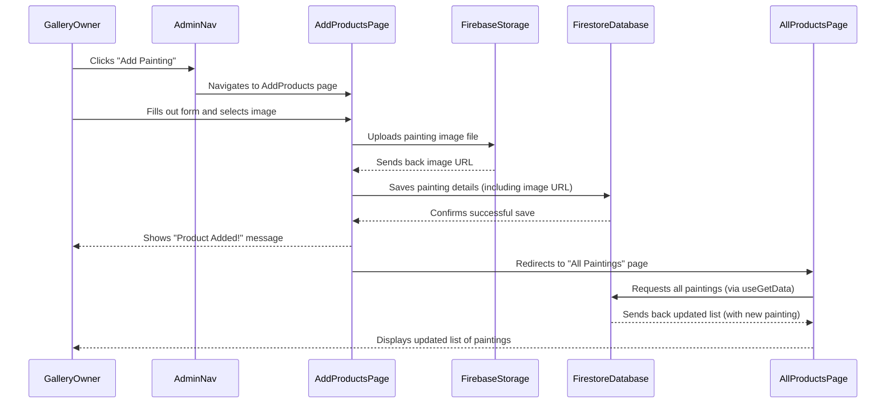

# Chapter 7: Admin Dashboards & Management

Welcome back, JMC-Store explorers! In our [previous chapter on User Authentication & Authorization](06_user_authentication___authorization_.md), we learned how JMC-Store identifies who is visiting our website and controls their general access. Now, we'll dive into the special, restricted areas designed for the gallery owner: the "Admin Dashboards & Management" section.

### What are Admin Dashboards & Management?

Imagine our JMC-Store art gallery not just from the visitor's perspective, but from the owner's. The owner doesn't just admire art; they manage it! They need to:
*   Add brand new paintings to the collection.
*   Invite new artists to showcase their work.
*   Keep track of all registered customers.
*   Oversee all the artists on the platform.

**Admin Dashboards & Management** is like the **gallery's operational control center** or the **"back office."** It's a set of specialized web pages and tools that give the gallery owner (the administrator) the power to manage all these aspects of the business.

**The main problem it solves:** How do we provide a secure, easy-to-use interface for the gallery owner to manage the entire online store's inventory, artists, and users without needing to write code or access complex databases directly?

Let's take a common scenario: The gallery owner acquires a stunning new painting. They need to quickly add it to the online store so customers can see and buy it. They also want to periodically review the list of all customers and artists to keep their records organized. The Admin Dashboard provides exactly these tools.

### Key Concepts for Management

To build this powerful control center, we combine several ideas we've learned in previous chapters with new, management-specific features:

#### 1. Admin-Specific User Interface (UI)
This is a dedicated set of pages and a navigation menu that *only* appears when an authorized administrator or artist logs in and accesses the "dashboard" part of the website. It provides direct links to all the management tools. This builds on our [Frontend Routing & Layout](01_frontend_routing___layout_.md) chapter, which showed how the `AdminNav` appears.

#### 2. Data Input Forms
These are web forms (like a digital questionnaire) where the administrator can type in details for new paintings or new artists. Once the form is filled out, the information is sent to our backend.

#### 3. Data Display Tables
For tasks like "View All Paintings" or "Manage Users," information is displayed in clear, organized tables. This uses the data fetched from our [Firebase Backend](05_firebase_backend_.md).

#### 4. Actions on Data
Next to each item in a table (like a painting or a user), there are buttons to perform actions, such as "Delete." These actions send commands to our [Firebase Backend](05_firebase_backend_.md) to modify or remove data.

#### 5. Authorization Enforcement
Crucially, these management tools are sensitive. We must ensure that *only* authorized users (specifically, administrators in this case, and potentially artists for their own content) can access them. This relies heavily on what we learned in [User Authentication & Authorization](06_user_authentication___authorization_.md). If an unauthorized user tries to sneak in, they'll be blocked!

### How JMC-Store Implements Admin Dashboards & Management

Let's walk through the key parts of the JMC-Store that create this operational control center.

#### 1. The Admin Navigation (`src/admin/AdminNav.jsx`)

As seen in [Chapter 1: Frontend Routing & Layout](01_frontend_routing___layout_.md), this is the special menu that appears at the top when you're in any `/dashboard` path. It's the gateway to all admin tools.

```javascript
// File: jmc-ecom/src/admin/AdminNav.jsx (Simplified)
import { NavLink } from 'react-router-dom';

const admin__nav = [
  { display: 'Dashboard', path: '/dashboard' },
  { display: 'All Paintings', path: '/dashboard/all-products' },
  { display: 'Users', path: '/dashboard/users' },
  { display: 'Artists', path: '/dashboard/artists' },
  { display: 'Add Painting', path: '/dashboard/add-product' },
  { display: 'Add Artist', path: '/dashboard/add-artist' },
];

const AdminNav = () => {
  return (
    <section>
      <div className="admin__navigation">
        <ul className="admin__menu-list">
          {admin__nav.map((item, index) => (
            <li className="admin__menu-item" key={index}>
              <NavLink to={item.path}>{item.display}</NavLink>
            </li>
          ))}
        </ul>
      </div>
    </section>
  );
};
export default AdminNav;
```
**Explanation:**
*   This component simply creates a list of `NavLink`s (from [Frontend Routing & Layout](01_frontend_routing___layout_.md)) that lead to different admin pages.
*   These links are only displayed when `Layout.jsx` detects the `/dashboard` route.

#### 2. The Dashboard Overview (`src/admin/Dashboard.jsx`)

This is the main "home page" of the admin section, giving a quick summary of the store's vital statistics.

```javascript
// File: jmc-ecom/src/admin/Dashboard.jsx (Simplified)
import { Col } from 'reactstrap';
import useGetData from '../custom-hooks/useGetData'; // Our data fetching tool

const Dashboard = () => {
  // Use useGetData (from Firebase Backend) to fetch counts
  const { data: products } = useGetData('products');
  const { data: users } = useGetData('users');
  const { data: artists } = useGetData('artists');

  return (
    <section>
      <Col className="lg-3">
        <div className="products__box">
          <h5>Total Products</h5>
          <span>{products.length}</span> {/* Display count of paintings */}
        </div>
      </Col>
      <Col className="lg-3">
        <div className="users__box">
          <h5>Total Users</h5>
          <span>{users.length}</span> {/* Display count of users */}
        </div>
      </Col>
      <Col className="lg-3">
        <div className="artists__box">
          <h5>Total Artists</h5>
          <span>{artists.length}</span> {/* Display count of artists */}
        </div>
      </Col>
      {/* ... other boxes like Total Sales ... */}
    </section>
  );
};
export default Dashboard;
```
**Explanation:**
*   It uses our `useGetData` custom hook (from [Firebase Backend](05_firebase_backend_.md)) to fetch all products, users, and artists.
*   It then simply displays the `.length` of these data arrays, giving a quick count.

#### 3. Adding New Paintings (`src/admin/AddProducts.jsx`)

This page provides a form for the administrator to list a new painting for sale.

```javascript
// File: jmc-ecom/src/admin/AddProducts.jsx (Simplified for form & submit)
import React, { useState } from 'react';
import { Form, FormGroup } from 'reactstrap';
import { toast } from 'react-toastify';
import { db, storage } from '../firebase.config'; // Firebase tools
import { ref, uploadBytesResumable, getDownloadURL } from 'firebase/storage';
import { collection, addDoc } from 'firebase/firestore'; // Firestore functions
import { useNavigate } from 'react-router-dom';

const AddProducts = () => {
  const [enterTitle, setEnterTitle] = useState('');
  const [enterProductImg, setEnterProductImg] = useState(null);
  const [loading, setLoading] = useState(false);
  const navigate = useNavigate();

  const addProduct = async (e) => {
    e.preventDefault();
    setLoading(true); // Start loading state

    try {
      // 1. Upload image to Firebase Storage (from Firebase Backend chapter)
      const storageRef = ref(storage, `productImages/${Date.now() + enterProductImg.name}`);
      const uploadTask = uploadBytesResumable(storageRef, enterProductImg);

      uploadTask.on(
        () => { toast.error('Images not uploaded!'); },
        async () => {
          const downloadURL = await getDownloadURL(uploadTask.snapshot.ref);
          // 2. Add product data to Firestore, including image URL
          await addDoc(collection(db, 'products'), {
            productName: enterTitle,
            imgUrl: downloadURL,
            // ... other painting details from form inputs ...
          });
          setLoading(false); // Stop loading
          toast.success('Product successfully added!');
          navigate('/dashboard/all-products'); // Go to all products list
        }
      );
    } catch (err) {
      setLoading(false);
      toast.error('Product not added! (not authorized)'); // Shows if Firebase Rules deny access
    }
  };

  return (
    <section>
      {loading ? (
        <h4 className="py-5 ">Loading.......</h4>
      ) : (
        <>
          <h4 className="mb-5">List A Painting</h4>
          <Form className="add__form" onSubmit={addProduct}>
            <FormGroup className="form__group">
              <span>Title</span>
              <input type="text" value={enterTitle} onChange={(e) => setEnterTitle(e.target.value)} required />
            </FormGroup>
            <FormGroup className="form__group ">
              <span>Image</span>
              <input type="file" onChange={(e) => setEnterProductImg(e.target.files[0])} required />
            </FormGroup>
            <button type="submit">List Painting</button>
          </Form>
        </>
      )}
    </section>
  );
};
export default AddProducts;
```
**Explanation:**
*   This component uses `useState` to keep track of the form inputs (like `enterTitle`, `enterProductImg`).
*   When the "List Painting" button is clicked, `addProduct` function runs.
*   It first uploads the chosen `enterProductImg` to [Firebase Storage](05_firebase_backend_.md).
*   Once the image is uploaded, it gets the unique `downloadURL` for that image.
*   Then, it uses `addDoc` (from [Firebase Backend](05_firebase_backend_.md)) to save all the painting's details (including the `imgUrl`) as a new document in the `products` collection in [Firestore Database](05_firebase_backend_.md).
*   The `loading` state is used to show a message while the process is ongoing, and the `toast.error('Product not added! (not authorized)')` message will appear if the current user doesn't have the necessary permissions (from [User Authentication & Authorization](06_user_authentication___authorization_.md)) to write to Firebase.

#### 4. Adding New Artists (`src/admin/AddArtist.jsx`)

Similar to adding paintings, this page allows the admin to register new artists.

```javascript
// File: jmc-ecom/src/admin/AddArtist.jsx (Simplified for form & submit)
import React, { useState } from 'react';
import { Form, FormGroup } from 'reactstrap';
import { toast } from 'react-toastify';
import { db, storage } from '../firebase.config'; // Firebase tools
import { ref, uploadBytesResumable, getDownloadURL } from 'firebase/storage';
import { doc, setDoc } from 'firebase/firestore'; // Firestore functions

const AddArtist = () => {
  const [username, setUsername] = useState('');
  const [email, setEmail] = useState('');
  const [uid, setUid] = useState(''); // Unique User ID (important for linking)
  const [file, setFile] = useState(null);
  const [loading, setLoading] = useState(false);

  const addArtist = async (e) => {
    e.preventDefault();
    setLoading(true);

    try {
      // Similar to AddProducts, upload image to storage first
      const storageRef = ref(storage, `images/${Date.now() + username}`);
      const uploadTask = uploadBytesResumable(storageRef, file);

      uploadTask.on(
        () => { toast.error('Images not uploaded!'); },
        async () => {
          const downloadURL = await getDownloadURL(uploadTask.snapshot.ref);
          // Save artist data to Firestore using a specific 'uid' as document ID
          await setDoc(doc(db, 'artists', uid), {
            displayName: username,
            email,
            photoURL: downloadURL,
            role: 'artist', // Assign a 'role'
            uid,
            // ... other artist details from form inputs ...
          });
          setLoading(false);
          toast.success('Artist added!');
        }
      );
    } catch (err) {
      setLoading(false);
      toast.error('Artist not added! (not authorized)');
    }
  };

  return (
    <section>
      {loading ? (
        <h4 className="py-5 ">You don&apos;t have access...</h4>
      ) : (
        <>
          <h4 className="mb-5">Add An Artist</h4>
          <Form className="add__form" onSubmit={addArtist}>
            <FormGroup className="form__group">
              <span>Email</span>
              <input type="text" value={email} onChange={(e) => setEmail(e.target.value)} required />
            </FormGroup>
            <FormGroup className="form__group">
              <span>Username</span>
              <input type="text" value={username} onChange={(e) => setUsername(e.target.value)} required />
            </FormGroup>
            <FormGroup className="form__group">
              <span>uid</span> {/* This 'uid' is often the Firebase Auth UID */}
              <input type="text" value={uid} onChange={(e) => setUid(e.target.value)} required />
            </FormGroup>
            <FormGroup className="form__group ">
              <span>Image</span>
              <input type="file" onChange={(e) => setFile(e.target.files[0])} required />
            </FormGroup>
            <button type="submit">Add Artist</button>
          </Form>
        </>
      )}
    </section>
  );
};
export default AddArtist;
```
**Explanation:**
*   This form is very similar to `AddProducts`, but it saves artist-specific data to the `artists` collection in [Firestore Database](05_firebase_backend_.md).
*   Notice `doc(db, 'artists', uid)` and `setDoc`. This means the document in Firestore will have a specific ID that matches the `uid` provided by the admin. This `uid` usually comes from [Firebase Authentication](05_firebase_backend_.md) when an artist first registers or is invited. Storing a `role: 'artist'` also helps with later [Authorization](06_user_authentication___authorization_.md) checks.

#### 5. Viewing and Managing All Paintings (`src/admin/AllProducts.jsx`)

This page lists all the paintings, allowing the admin to see them and delete any unwanted ones.

```javascript
// File: jmc-ecom/src/admin/AllProducts.jsx (Simplified for table and delete)
import React from 'react';
import { Col, Table } from 'reactstrap';
import { db } from '../firebase.config';
import { doc, deleteDoc } from 'firebase/firestore'; // Firestore delete function
import useGetData from '../custom-hooks/useGetData'; // Our data fetching tool
import { toast } from 'react-toastify';

const AllProducts = () => {
  const { data: productsData, loading } = useGetData('products'); // Fetch all products

  const deleteProduct = async (id) => {
    try {
      await deleteDoc(doc(db, 'products', id)); // Delete from Firestore
      toast.success('Deleted!');
    } catch (err) {
      toast.error('Could not delete. Not authorized?');
    }
  };

  return (
    <section>
      <Col lg="12">
        <Table className="table">
          <thead>
            <tr>
              <th>Image</th>
              <th>Title</th>
              <th>Action</th>
            </tr>
          </thead>
          <tbody>
            {loading ? (
              <h4 className="py-5 text-center fw-bold ">You don&apos;t have access...</h4>
            ) : (
              productsData.map((item) => (
                <tr key={item.id}>
                  <td></td>
                  <td>{item.productName}</td>
                  <td>
                    <button className="btn btn-danger" onClick={() => deleteProduct(item.id)}>
                      Delete
                    </button>
                  </td>
                </tr>
              ))
            )}
          </tbody>
        </Table>
      </Col>
    </section>
  );
};
export default AllProducts;
```
**Explanation:**
*   It uses `useGetData('products')` (from [Firebase Backend](05_firebase_backend_.md)) to fetch the latest list of all paintings in real-time.
*   The `productsData.map` creates a table row for each painting, displaying its image and title.
*   The "Delete" button calls `deleteProduct`, which uses `deleteDoc` (from [Firebase Backend](05_firebase_backend_.md)) to remove the painting's record from [Firestore Database](05_firebase_backend_.md). The "You don't have access..." message here also suggests a potential authorization issue.

#### 6. Viewing and Managing Users (`src/admin/Users.jsx`) and Artists (`src/admin/Artists.jsx`)

These pages are very similar to `AllProducts`, but they display lists of users and artists, respectively, allowing the admin to view and delete accounts.

```javascript
// File: jmc-ecom/src/admin/Users.jsx (Simplified for table and delete)
import React from 'react';
import { Col, Table } from 'reactstrap';
import useGetData from '../custom-hooks/useGetData'; // Our data fetching tool
import { deleteDoc, doc } from 'firebase/firestore';
import { db } from '../firebase.config';
import { toast } from 'react-toastify';

const Users = () => {
  const { data: usersData, loading } = useGetData('users'); // Fetch all users

  const deleteUser = async (id) => {
    try {
      await deleteDoc(doc(db, 'users', id)); // Delete from Firestore
      toast.success('User deleted!');
    } catch (err) {
      toast.error('Could not delete user. Not authorized?');
    }
  };

  return (
    <section>
      <Col lg="12">
        <h4 className="fw-bold">Users</h4>
      </Col>
      <Col lg="12" className="pt-5">
        <Table className="table ">
          <thead>
            <tr>
              <th>Username</th>
              <th>Email</th>
              <th>Action</th>
            </tr>
          </thead>
          <tbody>
            {loading ? (
              <h5 className="pt-5 fw-bold">You don&apos;t have access...</h5>
            ) : (
              usersData?.map((user) => (
                <tr key={user.uid}>
                  <td>{user.displayName}</td>
                  <td>{user.email}</td>
                  <td>
                    <button className="btn btn-danger" onClick={() => deleteUser(user.uid)}>
                      Delete
                    </button>
                  </td>
                </tr>
              ))
            )}
          </tbody>
        </Table>
      </Col>
    </section>
  );
};
export default Users;
```
**Explanation:**
*   `Users.jsx` uses `useGetData('users')` to fetch all registered users.
*   `Artists.jsx` (which would have very similar code) uses `useGetData('artists')` to fetch all registered artists.
*   Both provide a "Delete" button that uses `deleteDoc` to remove the respective record from [Firestore Database](05_firebase_backend_.md).
*   The `loading` message "You don't have access..." is a strong indicator that Firebase's security rules (part of [Firebase Backend](05_firebase_backend_.md) and enforced by [User Authentication & Authorization](06_user_authentication___authorization_.md)) are preventing an unauthorized user from viewing or modifying this sensitive data.

### How It All Works Together (Under the Hood)

Let's trace the journey of a gallery owner adding a new painting through the Admin Dashboard.


**Explanation:**
1.  The **Gallery Owner** clicks "Add Painting" in the **AdminNav**.
2.  The **AddProductsPage** loads, displaying a form.
3.  The **Gallery Owner** fills out the details and selects an image.
4.  The **AddProductsPage** first uploads the selected image to **Firebase Storage**.
5.  **Firebase Storage** returns a public web address (URL) for the image.
6.  The **AddProductsPage** then sends all the painting's details, *including the image URL*, to the `products` collection in **Firestore Database**.
7.  **Firestore** stores the new painting's record and confirms success.
8.  The **AddProductsPage** displays a success message and then redirects the **Gallery Owner** to the "All Paintings" page.
9.  The "All Paintings" page automatically fetches the *latest* data from **Firestore** (thanks to `useGetData`'s real-time capabilities), which now includes the newly added painting.
10. The **Gallery Owner** sees the updated list, confirming their painting is now part of the inventory!

Throughout this process, the underlying [User Authentication & Authorization](06_user_authentication___authorization_.md) system ensures that only a logged-in and authorized admin can access these pages and perform these critical operations, providing security for the store's data.

### Conclusion

In this final chapter, we explored "Admin Dashboards & Management," the operational heart of the JMC-Store. We learned how it serves as the gallery owner's control center, providing specialized interfaces to add new artworks, manage artists, and oversee user accounts. We saw how it integrates seamlessly with concepts from previous chapters, utilizing [Frontend Routing & Layout](01_frontend_routing___layout_.md) for dedicated navigation, and relying heavily on the [Firebase Backend](05_firebase_backend_.md) for secure data storage and real-time updates, all protected by [User Authentication & Authorization](06_user_authentication___authorization_.md). This robust backend management system ensures the gallery owner can efficiently run their online art store, making it a truly comprehensive application.

---

<sub><sup>Generated by [AI Codebase Knowledge Builder](https://github.com/The-Pocket/Tutorial-Codebase-Knowledge).</sup></sub> <sub><sup>**References**: [[1]](https://github.com/mhwebdevelopment/JMC-Store/blob/5458d78fa64e6f4f059a9638e7380066efb83ac3/jmc-ecom/src/admin/AddArtist.jsx), [[2]](https://github.com/mhwebdevelopment/JMC-Store/blob/5458d78fa64e6f4f059a9638e7380066efb83ac3/jmc-ecom/src/admin/AddProducts.jsx), [[3]](https://github.com/mhwebdevelopment/JMC-Store/blob/5458d78fa64e6f4f059a9638e7380066efb83ac3/jmc-ecom/src/admin/AdminNav.jsx), [[4]](https://github.com/mhwebdevelopment/JMC-Store/blob/5458d78fa64e6f4f059a9638e7380066efb83ac3/jmc-ecom/src/admin/AllProducts.jsx), [[5]](https://github.com/mhwebdevelopment/JMC-Store/blob/5458d78fa64e6f4f059a9638e7380066efb83ac3/jmc-ecom/src/admin/Artists.jsx), [[6]](https://github.com/mhwebdevelopment/JMC-Store/blob/5458d78fa64e6f4f059a9638e7380066efb83ac3/jmc-ecom/src/admin/Dashboard.jsx), [[7]](https://github.com/mhwebdevelopment/JMC-Store/blob/5458d78fa64e6f4f059a9638e7380066efb83ac3/jmc-ecom/src/admin/Users.jsx)</sup></sub>